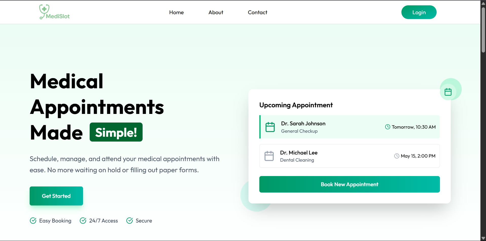
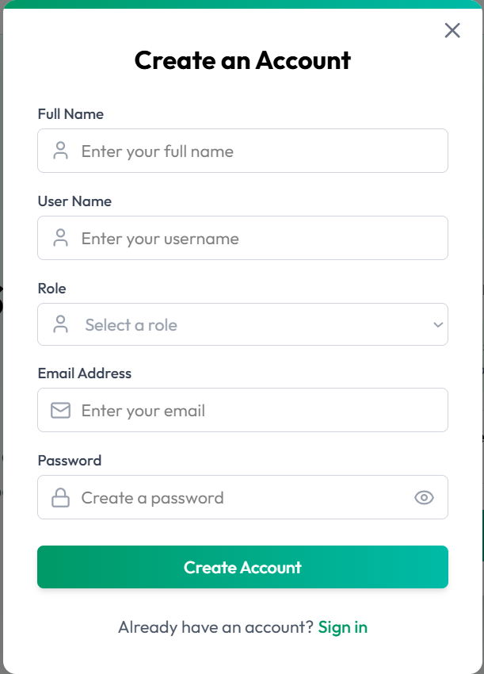

# 🩺 Smart Doctor Appointment System -Medislot

A full-stack MERN web application built to streamline doctor appointments with secure, role-based access for **Admin**, **Doctor**, and **Patient** users.

## 🚀 Features

- 🔐 **JWT Authentication & Role-Based Access Control**
  - Separate dashboards and permissions for Admin, Doctor, and Patient.
  - Passwords secured with bcrypt hashing.

- 🗂️ **Secure Image Upload**
  - Integrated **Multer** for file handling.
  - Cloud-based storage via **Cloudinary** for user avatars and reports.

- 💳 **Stripe Integration**
  - Seamless **payment processing** for appointment bookings.

- 📦 **MongoDB Transactions**
  - Ensured **ACID-compliant data consistency** across multi-step operations in the booking system.

## 🛠️ Tech Stack

- **Frontend:** React.js, Axios
- **Backend:** Node.js, Express.js
- **Database:** MongoDB (with Transactions)
- **Authentication:** JWT, bcrypt
- **File Handling:** Multer, Cloudinary
- **Payments:** Stripe

## 📸 Preview

###  Home Page

###  Login Page

###  Admin Dashboard

###  Booking Flow

## 📬 Contact

If you're interested in the implementation or want to discuss this project, feel free to reach out via [LinkedIn](https://www.linkedin.com/in/ashutosh-sahoo-32067b110/) or email at `ashutoshsahoo1985@gmail.com`.

---

